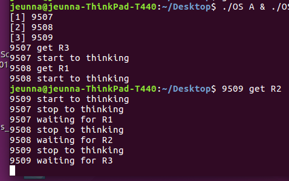


   
⁃   철학자 세명 A,B,C  
⁃   젓가락 세개 R1,R2,R3  
⁃   각 젓가락을 Mutual Exclusive 하게 만들기 위한 Lock L1, L2, L3  
⁃   젓가락이 없으면 기다리는 Condition Variable C1, C2, C3  
⁃   Lock 과 Condition Variable은 앞의 숙제처럼 리눅스 커널의 세마포로 구현  
⁃   R1,R2,R3는 앞의 숙제처럼 텍스트 화일(fileVar)로 구현

 

<h3 id="deadlock">Deadlock</h3>

Phil_A, Phil_B, Phil_C를 별도의 프로세스로 실행하여 데드락이 걸리는 상황을 만듦  
   

9507을 Phil_A라 보고 9508을 Phil_B, 9509를 Phil_C로 봤을 때,  
Phil_A가 R3을 집고 Phil_B가 R1을 집고 Phil_C가 R2를 집게 되었다.  
Phil_A는 R1을 집으려하고  Phil_B는 R2를, Phil_C는 R3를 집으려한다.

그러면 서로 하나의 젓가락을 잡고 다른 사람이 젓가락을 내려놓을 때까지 기다리므로 Deadlock에 걸리게 된다.  
   
 

<h3 id="deadlock을-해결하는-방법">Deadlock을 해결하는 방법</h3>

Prevention(예방) - Circular wait 조건을 깨는 방법  
   
  

10061이 Phil_A, 10062가 Phil_B, 10063이 Phil_C라고 볼 때,

Deadlock이 걸렸을 때는 모두 자신을 중심으로 왼쪽을 먼저 집고 다음으로 오른쪽의 젓가락을 집어서 Deadlock이 걸리게 되었었다.   
그래서 Deadlock이 걸리지 않도록 예방하기 위해서 Phil_A의 순서를 오른쪽을 먼저 집도록 변경했다.  
원래 였으면 Phil_A가 왼쪽 젓가락을 먼저 집어서 결국 Deadlock이 발생했겠지만 이번에는 오른쪽 젓가락인 R1을 먼저 집어서 Phil_B는 R1을 기다리고 Phil_A는 다음으로 R3를 집어서 무언가 먹을 수 있게 되었다.  
그리고나서 두 젓가락을 내려놓아서 다른 철학자들도 무언가 먹을 수 있게 되었다.

   
   
Avoiding(회피)   
   
  

6010을 Phil_A로 보고 6011을 Phil_B로, 6012를 Phil_C로 봤을 때,

Phil_A가 R3를 집고 Phil_B가 R1을 집고 그 후에 Phil_C가 R2를 집었다면 Deadlock이 발생했을 것이다. 그래서 Deadlock을 피하기 위해서 두 명이 각각 하나의 젓가락을 가지고 있다고 하면 남은 한 사람은 남은 하나의 젓가락을 집지 않고 기다리기로 한다.  
그래서 Phil_C는 다른 사람이 젓가락을 내려놓을 때까지 기다린다.  
Phil_A는 R1을 집으려 하지만 Phil_B가 이미 R1을 집고 있기 때문에 기다리고 Phil_B는 Phil_C가 그저 기다리고 있으므로 R2를 집을 수 있게 되어서 무언가를 먹을 수 있게 되었다. 그러고나서 젓가락을 내려놓으면 다른 철학자들도 젓가락을 집을 수 있게 된다.
