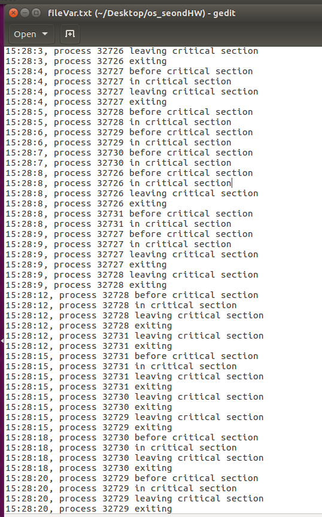
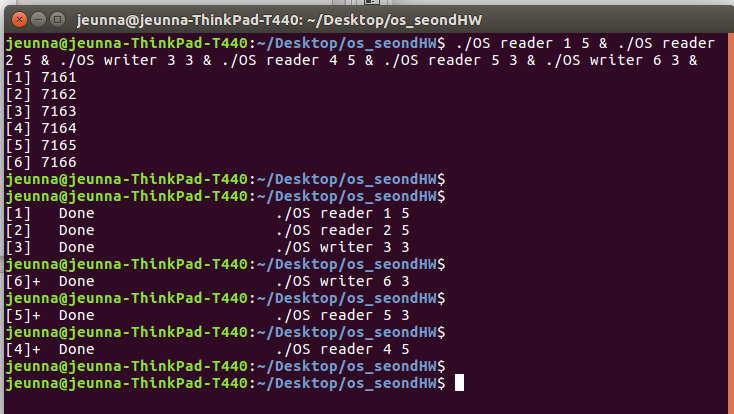


 

<h4 id="세마포를-이용하여-lock과-condition-variable을-만들어-구성된-mesa-style-monitor로-reader-writer-problem을-구현">세마포를 이용하여 Lock과 Condition Variable을 만들어 구성된 Mesa Style Monitor로 Reader &amp; Writer Problem을 구현</h4>

 

  

   
R1이 먼저 Reader로 들어오고 다음으로 R2가 Reader로 들어옵니다.  
W3는 도착해서 R1, R2가 돌아가고 있으니까 waiting하고 R4, R5, W6도 마찬가지로 waiting합니다.  
R1이 먼저 끝나고 다음으로 R2가 끝나서 waiting 하고 있는 W3를 깨웁니다.  
W3가 무언가하고 다음으로 기다리고 있는 W6를 깨웁니다.  
W6는 기다리고 있는 writer가 없으니까 Broadcasting으로 기다리고 있는 reader들을 전체 다 깨웁니다.  
그래서 마지막에는 R4랑 R5가 같이 무언가 하지만 실행시간이 더 긴 R4가 제일 마지막에 끝납니다.
